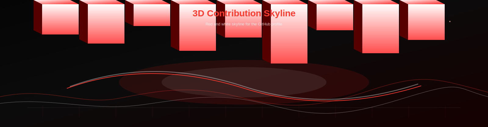

<div align="center">


<p>
  
  
  
</p>

<p>
  <a href="https://github.com/Aditya2005-cloud">
    
  </a>
  <a href="https://www.linkedin.com/in/adityasaha2005">
    
  </a>
  <a href="mailto:adityaxtyzhd@gmail.com">
    
  </a>
</p>

</div>

<div align="center">
  
</div>

## `> whoami`
```bash
name: Aditya Saha
role: Python Developer | Java Developer | AI/ML Engineer
mission: Build secure, intelligent, production-grade systems
interests: Ethical Hacking, Reverse Engineering, Cloud Architecture
```

## AI Assistant Console
```text
[BOOT] Neural assistant online...
[SCAN] Portfolio systems stable
[READY] Explore projects, stats, security interests, and contact channel
```

## Tech Stack Matrix
<div align="center">


</div>

## GitHub Command Center
<div align="center">


</div>

## Featured Projects
<div align="center">
  <a href="https://github.com/Aditya2005-cloud?tab=repositories">
    
  </a>
  <a href="https://github.com/Aditya2005-cloud?tab=repositories">
    
  </a>
  <a href="https://github.com/Aditya2005-cloud?tab=repositories">
    
  </a>
  <a href="https://github.com/Aditya2005-cloud?tab=repositories">
    
  </a>
</div>

## Certifications
- Cloud and security certifications: in progress
- AI/ML practical specialization: in progress
- Reverse engineering learning track: active

## Reverse Engineering + Cybersecurity Interests
- Malware analysis fundamentals
- Reverse engineering workflows and tooling
- Linux security and CLI tools
- Cloud security architecture
- CTF-style problem solving and labs

## Contribution Snake
<div align="center">
  
</div>

## 3D Contribution Skyline
<div align="center">
  
</div>

## Activity Feed
<!--START_SECTION:activity-->
<!--END_SECTION:activity-->

## Connect
<div align="center">
  <a href="https://www.linkedin.com/in/adityasaha2005">
    
  </a>
  <a href="mailto:adityaxtyzhd@gmail.com">
    
  </a>
</div>

## Future Upgrade: Full 3D Portfolio Site
```text
Planned stack: Next.js + React Three Fiber + Framer Motion + Tailwind + GSAP
Modules: 3D assistant avatar, holographic panels, particle world, interactive timeline,
GitHub live integrations, terminal navigation, cybersecurity dashboard.
```

<div align="center">

</div>
